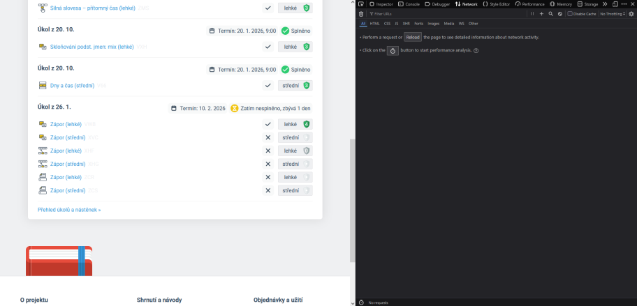
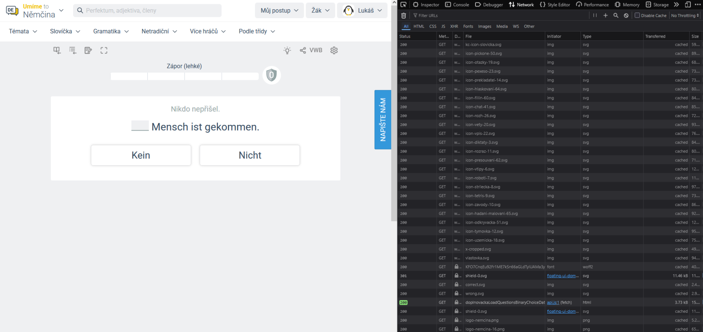
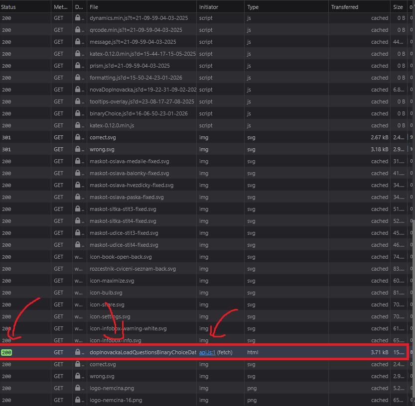
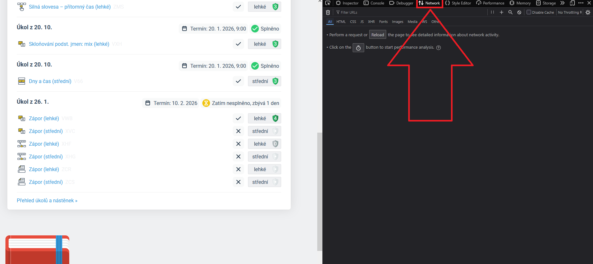
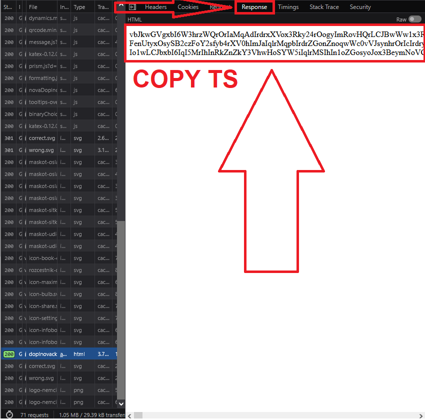
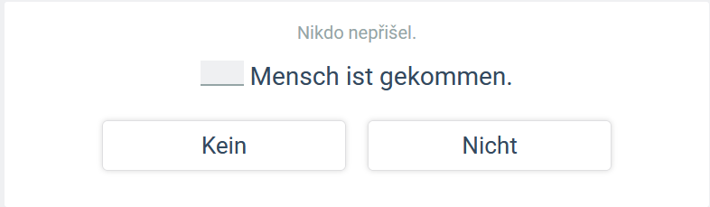
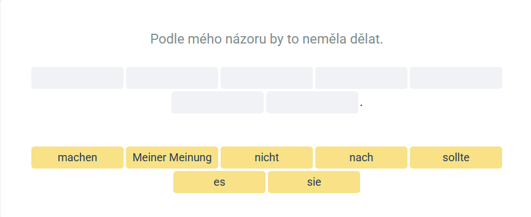
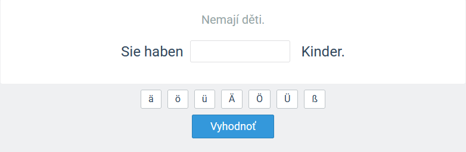

  

# Použití bota na Discordu

Bot slouží k přehlednému zobrazení správných odpovědí. Stačí použít jeden z příkazů níže a vložit obfuskovaný string, který se automaticky vloží jako `message.txt` kvůli character limitu discordu.
# Tutorial
- V následné ukázce budu používat [Firefox](https://www.mozilla.org/en-US/firefox/new/), ale bude fungovat jakýkoliv prohlížeč
- Načteme si stránku s úkoly
- Zapneme dev tools pomocí `F12` nebo `ctrl + shift + I`
- Navigujeme do záložky `Network`

  

- Načteme požadované cvičení

  

- V tabu `Network` nás zajímá tento paket:
- vyznačuje se zeleným číslem `200` (firefox)
- bývá většinou skoro úplně dole a má nějakej debilní dlouhej název

  

- Rozklikneme si tento paket a v tabu `Response` nás zajímá tento `string` (každý bude mít jedinečný string, z čehož vyplývá, že každý bude mít jiné pořadí otázek)
- Kopírujeme pomocí `CTRL + A` a následně `CTRL + C`

  

  

- tento string dále použijeme s libovolným příkazem ve formátu `/příkaz (string)` (string se automaticky přiloží jako message.txt z důvodu character limitu discordu, což nám nevadí)

# Příkazy

## `/rozhodovacka`

  

## `/serazovacka`

  

## `/vpisovacka`

  

## Tipy

- Pokud příkazy nevidíš, napiš v kanálu `@umimetosolver sync` nebo restartuj discord.
- Pokud chceš poslat zprávu od bota do chatu tak, aby to viděli všichni, napiš `@umimetosolver resend` a bot odešle do veřejného chatu poslední soukromou zprávu, kterou ti poslal

Disclaimer: Použitím příkazů bota souhlasíš se sbíráním analytických data o používání. Remember that *Big Brother* is **ALWAYS** watching ya 👀

